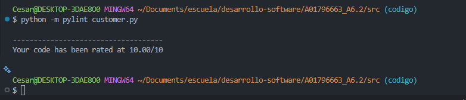
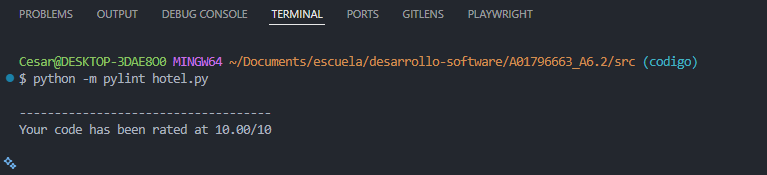
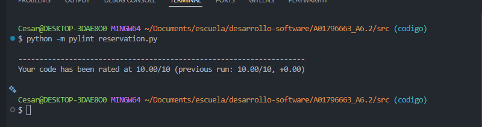
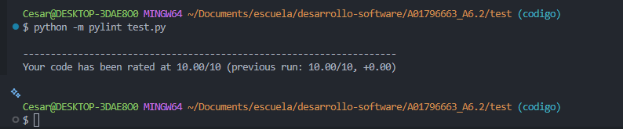

# Actividad 6.2 Ejercicio de programación 3 y pruebas de unidad

## Objetivos
* Explicar los fundamentos del desarrollo de pruebas unitarias 
* Desarrollar pruebas unitarias para fragmentos de programas usando las mejores prácticas recomendadas.

---

## Datos de entrega

* **Nombre:** Cesar Camilo.
* **Materia:** Pruebas de software y aseguramiento de la calidad.
* **Profesor:** Dr. Gerardo Padilla Zárate.
* **Fecha:** 20 de febrero 2026.
* **Actividad** 6.2 Ejercicio de programación 3 y pruebas de unidad
---

## Caracteristicas

### Ejercicio de programación 3: reservationSystem.py

| Programming Exercise | Description | Practice | Test Cases and Evidence |
| --- | --- | --- | --- |
| 1. Reservation System | Req 1. Implement a set of classes in Python that implements two abstractions:<br>1. Hotel<br>2. Reservation<br>3. Customers | • Control structures | Record the execution.<br>Use files included in the assignment. |
| &nbsp; | Req 2. Implement a set of methods to handle the next persistent behaviors (stored in files):<br>**1. Hotels**<br>&nbsp;&nbsp;&nbsp;a. Create Hotel<br>&nbsp;&nbsp;&nbsp;b. Delete Hotel<br>&nbsp;&nbsp;&nbsp;c. Display Hotel information<br>&nbsp;&nbsp;&nbsp;d. Modify Hotel Information<br>&nbsp;&nbsp;&nbsp;e. Reserve a Room<br>&nbsp;&nbsp;&nbsp;f. Cancel a Reservation<br>**2. Customer**<br>&nbsp;&nbsp;&nbsp;a. Create Customer<br>&nbsp;&nbsp;&nbsp;b. Delete a Customer<br>&nbsp;&nbsp;&nbsp;c. Display Customer Information<br>&nbsp;&nbsp;&nbsp;d. Modify Customer Information<br>**3. Reservation**<br>&nbsp;&nbsp;&nbsp;a. Create a Reservation (Customer, Hotel)<br>&nbsp;&nbsp;&nbsp;b. Cancel a Reservation | • Console Input output | &nbsp; |
| &nbsp; | You are free to decide the attributes within each class that enable the required behavior. | • Mathematical computation | &nbsp; |
| &nbsp; | Req 3. Implement unit test cases to exercise the methods in each class. Use the unittest module in Python. | • File management | &nbsp; |
| &nbsp; | Req 4. The code coverage for all unittests should accumulate at least 85% of line coverage. | • Error handling | &nbsp; |
| &nbsp; | Req 5. The program shall include the mechanism to handle invalid data in the file. Errors should be displayed in the console and the execution must continue. | &nbsp; | &nbsp; |
| &nbsp; | Req 6. Be compliant with PEP8. | &nbsp; | &nbsp; |
| &nbsp; | Req 7. The source code must show no warnings using Fleak and PyLint. | &nbsp; | &nbsp; |

## Estructura del proyecto

El proyecto está organizado de la siguiente manera:

```text
A01796663_A6.2/
├── capturas/
│   ├── plint-customer.png
│   ├── plint-hotel.png
│   ├── plint-Reservation.png
│   └── plint-test.png
├── src/
│   ├── customer.py       # Manejo de clientes
│   ├── hotel.py          # Manejo de hoteles
│   └── reservation.py    # Manejo de reservaciones
├── test/
│   ├── .pylintrc         # Configuración de pylint para los tests
│   └── test.py           # Pruebas unitarias
└── README.md             # Documentación del proyecto
```

## Pruebas PyLint

Capturas de la ejecución de PyLint en los archivos del proyecto.
### `customer.py`


### `hotel.py`


### `reservation.py`


### `test.py`


## Actualizaciones Futuras del proyecto:
* Verficación de los test.
* Actualización del archivo README para una mejor documentación.
